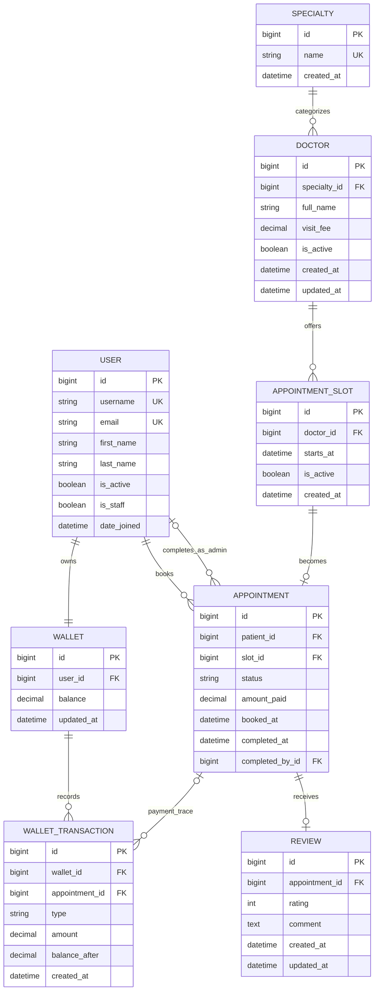

# ERD — Architecture Baseline v1.0

This diagram represents the agreed storage baseline. OTP persistence is intentionally excluded until ADR-012 is finalized.

## Required constraints

- `User.email` unique.
- `Specialty.name` unique.
- `Doctor.visit_fee >= 0`.
- `(doctor_id, starts_at)` unique for slots.
- `Appointment.slot_id` unique.
- `Appointment.amount_paid >= 0`.
- `Wallet.user_id` unique.
- `Wallet.balance >= 0`.
- `WalletTransaction.amount > 0`.
- `WalletTransaction.balance_after >= 0`.
- `Review.appointment_id` unique.
- `Review.rating` between 1 and 5.

## Notes

- Slot availability is derived from the existence/absence of an Appointment plus slot activity; no independent `is_booked` field is part of the baseline.
- `Appointment.amount_paid` is a historical fee snapshot.
- `WalletTransaction.appointment_id` is nullable because `TOP_UP` has no appointment.
- For `APPOINTMENT_PAYMENT`, an appointment reference is required by the application contract.
- OTP persistence remains outside the ERD until ADR-012 is finalized.
