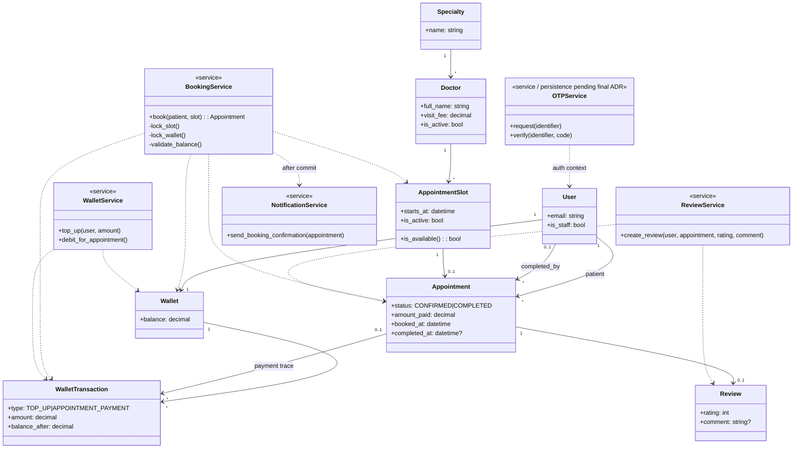

# UML 2 — Domain Class Diagram

The domain-class view captures responsibilities in addition to persistence.

## Responsibility rules

- `BookingService` owns the atomic booking orchestration and race-condition-sensitive locks.
- `WalletService` owns wallet mutations and ledger creation.
- `ReviewService` enforces the completed-appointment eligibility rule.
- `NotificationService` is invoked only after successful booking commit.
- OTP behavior is represented as a service boundary; persistence remains governed by ADR-012.
