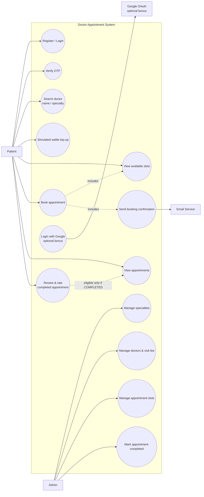

# UML 1 — Use Case Diagram

The use-case baseline defines the mandatory patient/admin scope and the optional external OAuth bonus.

## Architecture notes

- `Doctor` is **not** an actor in baseline v1.0 because no doctor login/panel is a mandatory requirement.
- Admin is an actor backed by Django authentication/permissions; there is no separate `Admin` entity in the ERD.
- Review/rating eligibility requires a completed appointment.
- OTP persistence details remain pending under ADR-012.
